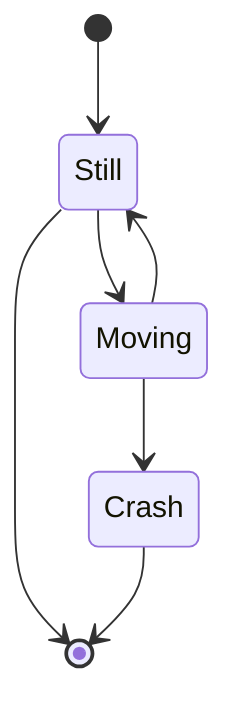

# remark-mermaid-dataurl

[](https://www.npmjs.com/package/remark-mermaid-dataurl)
[](https://www.npmjs.com/package/remark-mermaid-dataurl)
[](https://www.npmjs.com/package/remark-mermaid-dataurl)
[](https://www.npmjs.com/package/remark-mermaid-dataurl)

A [remark markdown](https://github.com/remarkjs/remark)
plugin that renders mermaid markdown code into SVG
[data URLs](https://developer.mozilla.org/en-US/docs/Web/HTTP/Basics_of_HTTP/Data_URLs)
using [mermaid-cli](https://github.com/mermaid-js/mermaid-cli).

> **Note**:
>
> This plugin is designed for Markdown to Markdown conversions, where keeping
> everything in a single file is required. The following plugins are more
> efficient in the majority of cases:
>
> - **Markdown → HTML**: [rehype-mermaidjs](https://github.com/remcohaszing/rehype-mermaidjs)
> - **Markdown → Markdown with inline HTML**: [remark-mermaidjs](https://github.com/remcohaszing/remark-mermaidjs)

## Example

Write your mermaid code in markdown using within code-blocks that start with
` ```mermaid`, as in below:

````markdown
Here is my **example** mermaid diagram in markdown:


````

After running `remark-mermaid-dataurl`, the mermaid diagram within the ` ```mermaid `
code block will be rendered into an SVG file, then inserted into the markdown
code as a
[dataurl](https://developer.mozilla.org/en-US/docs/Web/HTTP/Basics_of_HTTP/Data_URLs)
(dataurl is truncated in the example, as they are quite large):

````markdown
Here is my **example** mermaid diagram in markdown:


    // passing configFile or puppeteerConfigFile as an object will automatically be converted into a JSON
    configFile: {
      // see mermaid options at https://mermaid-js.github.io/mermaid/#/Setup
      theme: "forest",
    },
    puppeteerConfigFile: {
      // see options at https://github.com/puppeteer/puppeteer/blob/main/docs/api.md#puppeteerlaunchoptions
      product: "firefox" // use firefox instead of chrome
      timeout: 60000, // change default puppeteer launch timeout
    },
  }
}
```

## Usage with Docusaurus

_see https://v2.docusaurus.io/docs/markdown-features#configuring-plugins for more info_

First, install this plugin:

```bash
npm install --save remark-mermaid-dataurl
```

Then, add them to your `@docusaurus/preset-classic` options in `docusaurus.config.js`:

```js
module.exports = {
  // ...
  presets: [
    [
      "@docusaurus/preset-classic",
      {
        docs: {
          // ...
          remarkPlugins: [
            require("remark-mermaid-dataurl"),
            // options, // optional options here
          ],
        },
      },
    ],
  ],
};
```

Afterwards, any ` ```markdown ` code blocks in your docusaurus docs folder
should automatically be converted into SVGs data URLs when running
`npx docusaurus start` or `npx docusuarus serve`.
