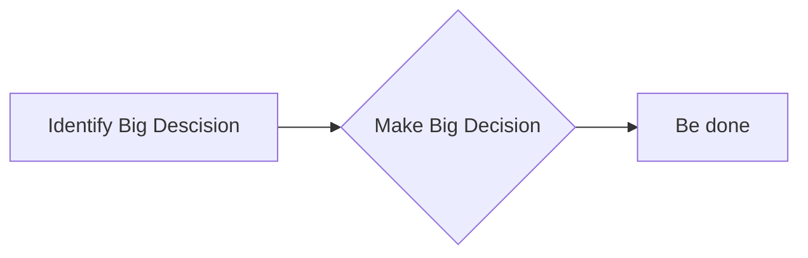

# Markdown with accessible title/description

The follow mermaid diagram should be rendered to markdown and show a title
and description for users with visual impairments.

```mermaid
graph LR
    accTitle: My super cool mermaid diagram
    accDescr: An example of a mermaid flowchart diagram
    A[Identify Big Descision] --> B{Make Big Decision}
    B --> D[Be done]
```
