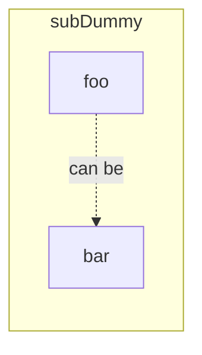

# Example of new flowchart syntax

From https://github.com/aloisklink/remark-mermaid-dataurl/issues/20

This flowchart uses the `direction` option in a `subgraph`,
which is only added in
[Mermaid 8.10.2](https://github.com/mermaid-js/mermaid/releases/tag/8.10.2)

