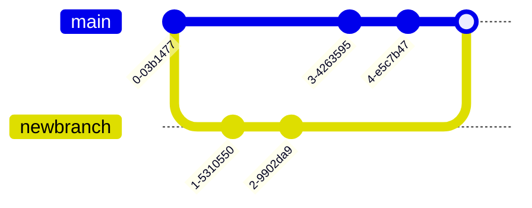

# Git Graph mermiad example

Here is an experimental example of using git graph

```mermaid
---
config:
    gitGraph:
        nodeSpacing: 150
        nodeRadius: 10
---
gitGraph
commit
branch newbranch
checkout newbranch
commit
commit
checkout main
commit
commit
merge newbranch
```
