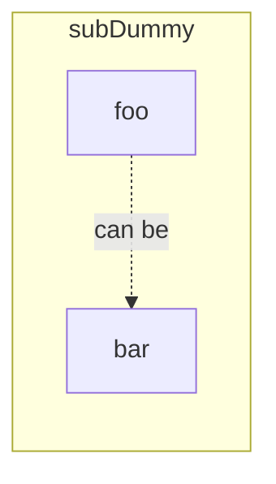

# Multiple Digrams in one file

```mermaid
flowchart TB
subgraph subDummy
    direction TB
    foo[foo] -. can be .-> bar
end
```

```mermaid
flowchart TB
subgraph subDummy
    direction TB
    foo[foo] -. can be .-> bar
end
```

```mermaid
flowchart TB
subgraph subDummy
    direction TB
    foo[foo] -. can be .-> bar
end
```

Line 2

```mermaid
flowchart TB
subgraph subDummy
    direction TB
    foo[foo] -. can be .-> bar
end
```

```mermaid
flowchart TB
subgraph subDummy
    direction TB
    foo[foo] -. can be .-> bar
end
```

```mermaid
flowchart TB
subgraph subDummy
    direction TB
    foo[foo] -. can be .-> bar
end
```

Line 3

```mermaid
flowchart TB
subgraph subDummy
    direction TB
    foo[foo] -. can be .-> bar
end
```

```mermaid
flowchart TB
subgraph subDummy
    direction TB
    foo[foo] -. can be .-> bar
end
```

```mermaid
flowchart TB
subgraph subDummy
    direction TB
    foo[foo] -. can be .-> bar
end
```
